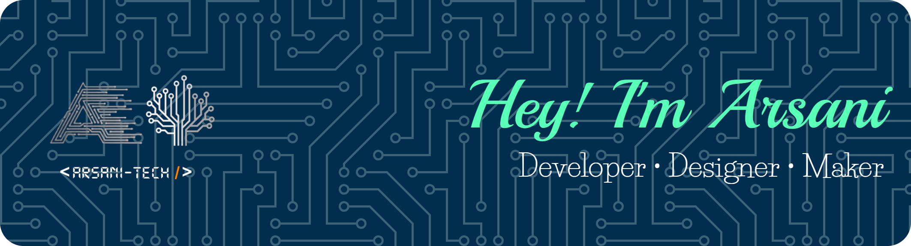

  

# 💫 About Me:
 
Hello! I'm Arsani Magdi, a passionate developer and tech enthusiast. I enjoy making projects that have a creative touch, from web applications down to desktop ones. I love trying new technologies and further honing my skills in programming and electronics.  Presently, I am a student at Collège Saint-Marc, where I enjoy learning both in the classroom and through hands-on projects.  

🔧 **Hobbies:**  Robotics, electronics, coding challenges, and building personal projects  🌱 **Currently learning:** Advanced React and Flutter development You can check out my projects below, and feel free to connect with me!

### 🌐 Socials:
     
 
 
# 💻 Tech Stack:
### 🖥️ Languages
 
 
 
 
 
 
 
 
 
 
 
 
 
 
 
 
 
 
 
 
### 🌐 Web & Mobile
 
 
 
 
 
 
 
 
 
 
 
 
 
 
 
### 💾 Databases & Backend
 
 
 
 
 
 
 
 
 
 
### ☁️ Cloud & DevOps
 
 
 
 
 
 
 
 
 
 
### 🎨 Design & Multimedia
 
 
 
 
 
 
 
 
### 🛠️ Tools & Productivity
 
 
 
 
 
 
 
 
### 📡 IoT & Hardware
 
 
 
 
 
 
 
 
 
 

# 📊 GitHub Stats:

 

  
  

 
 

  
  
  

